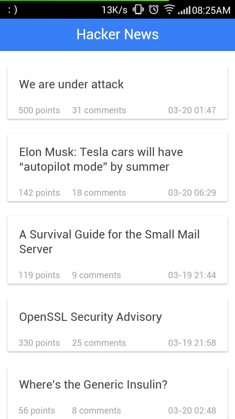
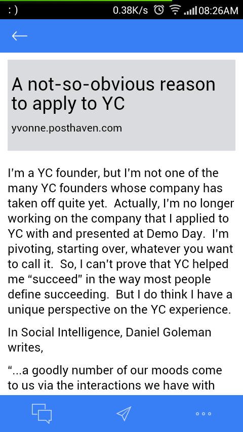
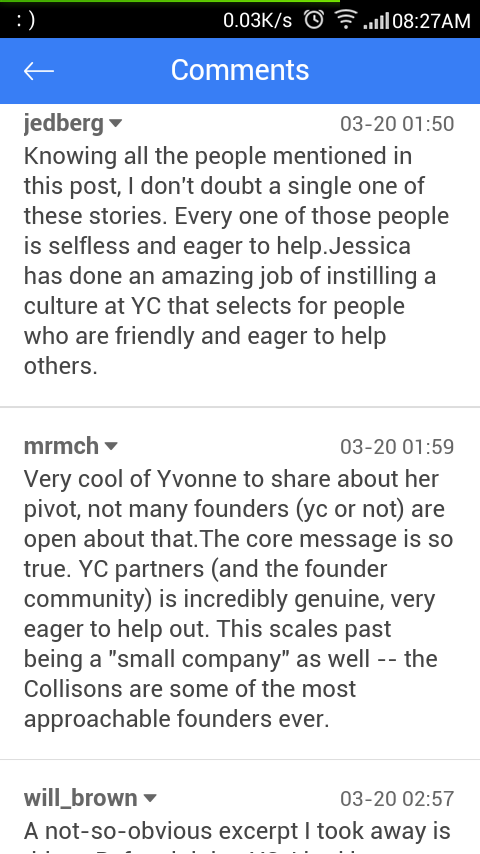

# Ionic App Demo


HackerNews app power by [ionic framework](http://ionicframework.com/)

[Download Android version](http://7b1ezf.com1.z0.glb.clouddn.com/HN.apk)

##Screenshot






##Get started

- `git clone https://github.com/keith3/HN_app.git`
- [install ionic and its dependencies](http://ionicframework.com/docs/guide/installation.html)
- add platform `ionic platform add android/ios`
- install cordova plugins:
```bash
cordova plugin add https://github.com/VersoSolutions/CordovaClipboard
cordova plugin add org.apache.cordova.device
cordova plugin add org.apache.cordova.inappbrowser
cordova plugin add https://github.com/driftyco/ionic-plugins-keyboard.git
cordova plugin add org.apache.cordova.network-information
cordova plugin add https://github.com/EddyVerbruggen/SocialSharing-PhoneGap-Plugin.git
cordova plugin add https://github.com/EddyVerbruggen/Toast-PhoneGap-Plugin.git
cordova plugin add cordova-plugin-console
```
- `ionic serve` debug in browser
- `ionic run android/ios` install the app on your android/ios device.

